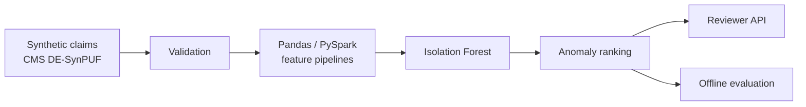

# ClaimGuard

**Explainable healthcare claims anomaly ranking for payment-integrity review.**

ClaimGuard is a portfolio-grade machine-learning system that identifies unusual claim patterns and prioritizes them for human review. It combines privacy-safe synthetic data, reproducible feature engineering, an unsupervised anomaly model, offline evaluation, reason codes, and a FastAPI scoring service.

> ClaimGuard does not determine fraud and does not make payment or clinical decisions. It ranks anomalies that may warrant review.

## Why this project matters

Payment-integrity teams review large claim volumes with limited investigator capacity. A useful system must do more than produce an anomaly score: it should support prioritization, provide understandable reasons, operate reproducibly, and make its limitations explicit.

The current implementation supports privacy-safe generated claims and CMS DE-SynPUF ingestion, with a Pandas baseline and parity-tested PySpark feature engineering for distributed claim-volume processing.

## Current capabilities

- Parity-tested PySpark feature engineering with distributed 30-day windows
- Privacy-safe synthetic healthcare claims
- CMS DE-SynPUF adapters for inpatient, outpatient, carrier, and prescription events
- Evaluation-only injected anomaly scenarios
- Schema and data-quality checks
- Provider, beneficiary, cost, duplicate, utilization, and temporal features
- Isolation Forest anomaly-ranking pipeline
- Precision@K, Recall@K, ROC-AUC, and average-precision evaluation
- Persisted model artifact with version metadata
- FastAPI batch-scoring endpoint
- Human-readable reason codes
- Automated tests and GitHub Actions CI
- Docker-ready API service

## Architecture



## Repository structure

```text
claim-guard/
├── configs/                 # Reproducible experiment settings
├── docs/                    # Architecture, roadmap, and model card
├── src/claimguard/
│   ├── api/                 # FastAPI service and schemas
│   ├── data/                # Synthetic generation and validation
│   ├── features/            # Claim-level feature engineering
│   ├── models/              # Training, scoring, persistence
│   ├── evaluation.py        # Ranking metrics
│   ├── pipeline.py          # End-to-end training workflow
│   └── cli.py               # Command-line entry point
└── tests/                   # Unit and integration tests
```

## Quick start

Java 17 or newer is required to run the PySpark feature pipeline and Spark tests.

```bash
python -m venv .venv
source .venv/bin/activate
pip install -e ".[dev,spark]"
claimguard train --config configs/base.yaml
pytest -q
```

The training command creates:

- `data/raw/synthetic_claims.csv`
- `data/processed/scored_claims.csv`
- `artifacts/isolation_forest.joblib`
- `artifacts/metrics.json`

Convert an official CMS DE-SynPUF file and train without inventing labels:

```bash
claimguard ingest-cms \
  --input data/cms/outpatient_claims.csv \
  --claim-type outpatient \
  --output data/processed/cms_outpatient_claims.csv

claimguard train-csv \
  --input data/processed/cms_outpatient_claims.csv \
  --config configs/cms.yaml
```

See [CMS DE-SynPUF ingestion](docs/cms_synpuf.md) for mappings, source links, and limitations.

Run the API after training:

```bash
uvicorn claimguard.api.main:app --reload
```

Interactive documentation is available at `http://localhost:8000/docs`.

## Example scoring request

```bash
curl -X POST http://localhost:8000/v1/score \
  -H "Content-Type: application/json" \
  -d '{
    "claims": [{
      "claim_id": "CLM-DEMO-001",
      "claim_type": "outpatient",
      "paid_amount": 32000,
      "diagnosis_count": 8,
      "procedure_count": 6,
      "units": 55,
      "length_of_stay": 0,
      "provider_claim_count_30d": 60,
      "beneficiary_claim_count_30d": 5,
      "provider_paid_zscore": 6.2,
      "duplicate_indicator": 0,
      "weekend_service": 0
    }]
  }'
```

## Evaluation design

The model is unsupervised. Synthetic anomaly labels are used only for offline evaluation and never become training features. Ranking metrics are emphasized because investigator capacity is limited and the business need is prioritization.

### Verified Phase 1 sample run

Using the committed configuration and seed, the starter pipeline processed 5,000 synthetic claims with 200 injected evaluation anomalies:

| Metric | Result |
|---|---:|
| ROC-AUC | 0.9166 |
| Average precision | 0.4791 |
| Precision@200 | 0.4400 |
| Recall@200 | 0.4400 |

These results establish a reproducible engineering baseline. They should not be interpreted as real-world payment-integrity performance.

Do not present the starter metrics as real-world fraud-detection performance. CMS synthetic data and the injected scenarios are development tools, not clinical or payment truth.

## Roadmap

1. Add a transparent rule-based baseline and ensemble scoring.
2. Add SHAP or feature-contribution explanations for a supervised benchmark.
3. Build the investigator work-queue dashboard.
4. Add MLflow experiment tracking, drift reports, and cloud deployment.
5. Publish a detailed case study and live demo.

## Responsible use

ClaimGuard is an educational decision-support project. Flagged claims require qualified human review. The system must not be used to deny care, stop payment, accuse a provider, or make an adverse decision without appropriate investigation and governance.

## Author

Gowtham Kondabolu — Data Scientist & Machine Learning Engineer
