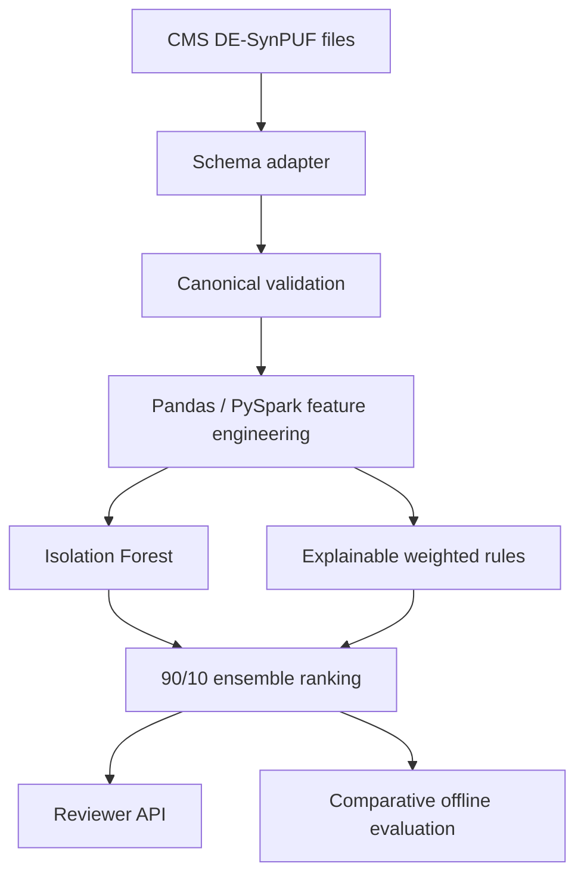

# Architecture and design decisions

## Product boundary

ClaimGuard is a review-prioritization system. Its output is an anomaly ranking with reason codes. A reviewer, not the model, determines whether the claim needs investigation.

## Current flow

1. Generate privacy-safe synthetic claims and inject a small number of known anomaly scenarios.
2. Validate identifiers, required fields, amounts, and utilization counts.
3. Create cost, utilization, duplication, provider-relative, and temporal features using the Pandas baseline or the parity-tested PySpark window pipeline.
4. Fit an Isolation Forest without using the evaluation label.
5. Apply transparent weighted rules for provider-relative cost, excess units, duplicate claims, and provider or beneficiary utilization.
6. Calibrate model scores against the training-score distribution and combine them with rule scores using a configurable model-dominant ensemble.
7. Rank claims by ensemble score and apply a configurable review-capacity threshold.
8. Compare Isolation Forest, rule, and ensemble rankings against injected evaluation labels.
9. Persist the calibrated model artifact and expose ensemble batch scoring through FastAPI.

## Key decisions

### Ranking instead of fraud classification

Synthetic claims do not supply reliable fraud labels. The project therefore models anomaly prioritization. This is both more honest and closer to a real investigator work queue.

### Precision@K and Recall@K

Operations teams can inspect only a finite number of claims. Precision and recall within the review budget are more actionable than accuracy on an imbalanced dataset.

### Evaluation-only injected labels

Injected scenarios provide deterministic pipeline tests and offline comparisons. They are excluded from all model features. Results measure recovery of the injected patterns, not real-world fraud performance.

### Enriched API contract

The scoring API accepts enriched utilization and provider-relative features. The PySpark builder now computes distributed offline provider and beneficiary aggregates while preserving the existing model feature contract. A low-latency feature service backed by persisted point-in-time aggregates remains planned.

### Calibrated ensemble scoring

Isolation Forest scores are converted to percentiles using the persisted training-score reference distribution, avoiding request-batch-dependent normalization. The transparent rules produce a bounded score from explicit cost, unit, duplicate, and utilization conditions. ClaimGuard combines the calibrated model percentile and rule score using a configurable 90/10 model-dominant weight.

The training pipeline persists the ensemble weight and review threshold in the model artifact. The API therefore applies the same scoring contract to single-claim and batch requests while returning the raw model score, calibrated percentile, rule score, ensemble score, review flag, and reason codes.

## CMS ingestion architecture

The CMS adapter supports inpatient, outpatient, carrier, and prescription-event files. It maps each source into the same validated ClaimGuard schema while preserving source lineage. See [CMS DE-SynPUF ingestion](cms_synpuf.md).

### Distributed feature engineering

The PySpark builder uses value-based 30-day windows for provider and beneficiary claim counts, partitioned provider statistics for paid-amount z-scores, and distributed duplicate and temporal indicators. Parity tests ensure the Spark output preserves the existing model feature contract. The Pandas path remains the default local training implementation.

## Planned production controls

- Dataset and model versioning
- Point-in-time-correct feature generation
- Training/serving skew checks
- Feature and score drift monitoring
- Calibration of review thresholds against investigator capacity
- Reviewer feedback capture
- Subgroup performance monitoring
- Access control and audit logging
